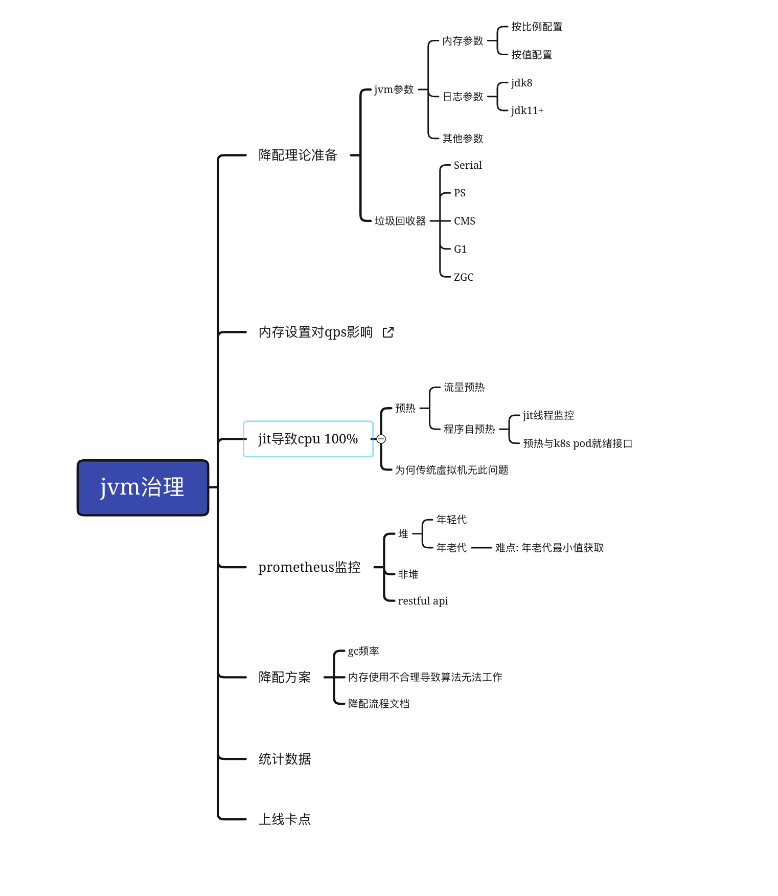
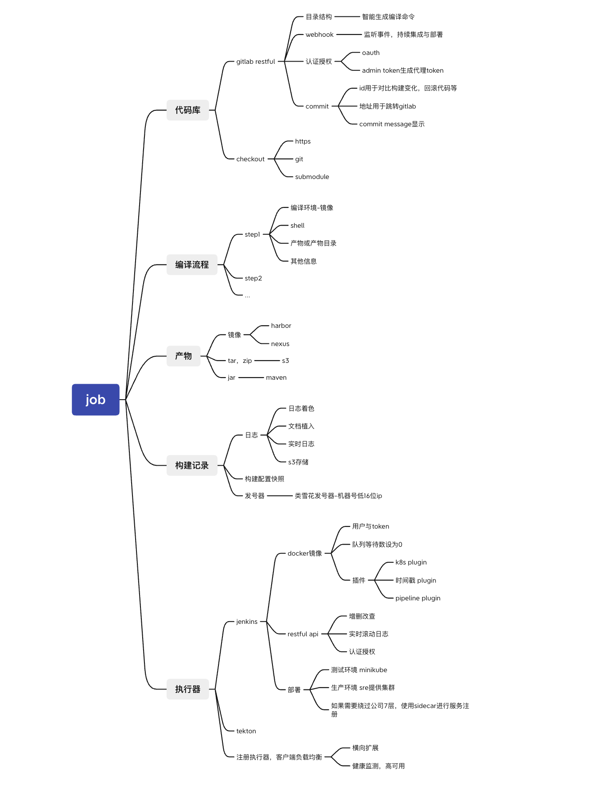
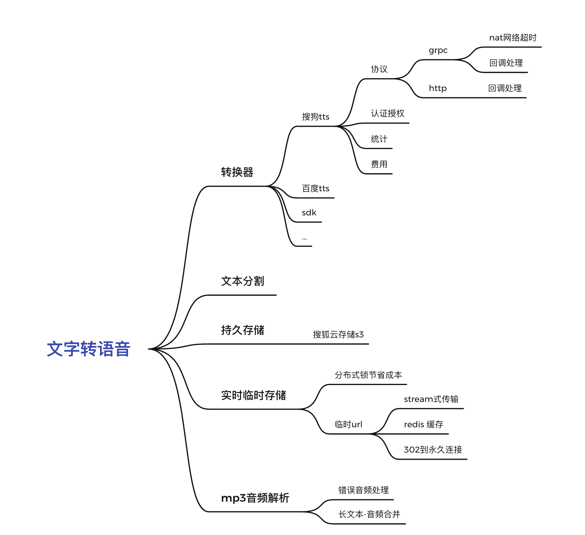

include::../attributes.adoc[]

link:../en/index.html[English Resume]

== 基本信息

* 姓名 李炳龙
* 电话 15620011679
* 邮箱 2376771274@qq.com

== 教育经历
* 本科 2012.9-2016.6 南京邮电大学(双一流) 电子信息工程
* 高中 2009.9-2012.6 河北省沧县中学

== 个人技术栈
主要开发语言java。go，python，js也有开发能力

link:https://www.libinglong.tech/blogs[个人博客]

. java方面的能力是很强的
. 有一定的前端开发能力
. 熟悉docker k8s等云原生相关技术栈

=== 一些二次开发或自研的中间件
* md-cache 基于注解的缓存，相比Springboot注重一致性，性能
* Skywalking跨线程插件
* gateway定制化开发
** 实现修改路由配置后所有节点实时生效
** 路由查询功能
** 防篡改，防重放过滤器

=== sdk整合
* sharding-jdbc
* maxwell-docker mysql bin-log同步器
* spring-cloud配置中心
* feign-client
* sharding-proxy docker

=== devops
* 缓存maven组件加快编译速度
* 基于gitlab ci/cd的持续交付
* 基于docker in docker技术编译
* 使用docker运行服务
* mysql分库分表ShardingSphere基础设施搭建
* 链路追踪Skywalking落地

== 工作经历

=== 贝壳找房 2021.7--今(10个月)
* 基于SpringBoot的Keboot框架开发与维护
* jvm治理
+

* 应用构建系统设计与开发
+

=== 搜狐 2018.7--2021.7(3年)

==== 搜狐新闻app
搜狐新闻主app。 负责内容：用户与设备，用户关注关系，feed及转评赞，听新闻

==== 狐狸金服app

狐狸慧贷服务(app接口)，房进件服务(h5接口)，房产询值服务，saas业务

* gateway网关
** oauth2 认证授权

* 房产询值
** SpringBoot + Selenium(浏览器测试框架用于内容爬取)
* 进件服务，狐狸慧贷服务

=== 中软国际 2018.1--2018.7(7个月)
* 华为手机自动化测试框架及脚本开发 cida任务管理
* lcm机器管理

=== 天津联通 2016.7--2018.1(1年)
腾讯王卡，百度神卡等各种流量卡的订单系统开发与维护

== 个人爱好
唱歌，网球，读书

== 开源社区贡献

* 分布式链路追踪Apache Skywalking

+
--
https://skywalking.apache.org/blog/2021-02-09-skywalking-trace-threadpool/[How to propagate context between threads when using ThreadPoolExecutor]

https://github.com/apache/skywalking/pull/5158[修复-Apache Skywalking agent内核在某些机器中因并发错误无法正常运行的问题]

https://github.com/apache/skywalking/pull/6103[增加特性-多版本兼容-方法级别的粒度]

https://github.com/apache/skywalking/pull/6309[增加特性-添加错误监听，方便插件开发人员定位错误]
--

* Fastjson
+
--
https://github.com/alibaba/fastjson/pull/2184[修复fastjson序列化错误]
--

* manim 3blue1brown开源的数学动画制作软件
+
--
https://github.com/3b1b/manim/pull/1481[manim latex格式化错误]
https://github.com/3b1b/manim/pull/1488[manim 文档代码与视频演示不匹配]
--

* reactor-core
+
https://github.com/reactor/reactor-core/pull/2449[修复拼写错误]

== 文章

发表于"搜狐产品技术"，并获得了稿酬(500元/篇)

* https://mp.weixin.qq.com/s/joqGDKqg69V7ytoAcFEkxw[java史诗级低时延性能调优1]
* https://mp.weixin.qq.com/s/gpon4FCZnu47n2NlFbeMmA[java史诗级低延迟性能调优2]